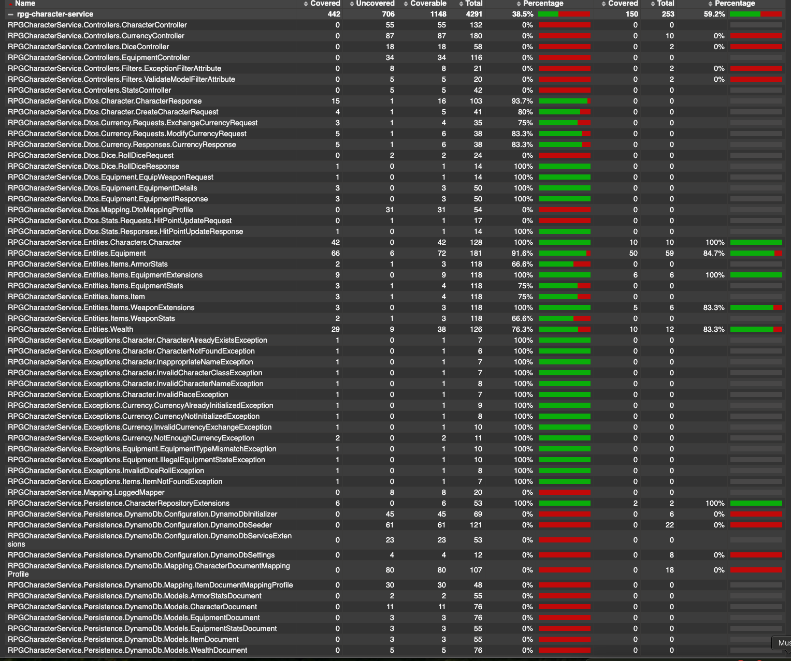

# RPG Character Manager - Fortis Prompt Part 1

This document explains the decisions I made while implementing the first part of the Fortis Atlas Project Prompt.

---

## Application Requirement Assumptions

- For 1.a, I assumed this was not a high CCU (Concurrent Connected Users) application.
- Therefore, I did not optimize for ultra-high concurrency concerns like distributed locks or partitioned reads,
tho I did try to make the application future proof for that (since we have question 2).
- I focused on clarity, durability, and future-readiness first.

---

## API Related Decisions

### Generating Initial Currency

Initially, it felt strange to separate initial currency generation from character creation.
However, considering how RPGs often allow partial or staged creation flows (e.g., roll stats first, pick class later), it made sense.

When deciding on endpoint structure:
- I grouped the API under the currency domain (`/currency/init`) rather than `/character/init-currency`.
- Reason: Consistency — all currency-related logic (exchange, modify, initialize) should live in one place.

Grouping by domain improves organization, avoids bloated controllers, and helps future scaling.

### Minimize Inventory Conflicts

Inventory management was not specified in the prompt.

Therefore:
- No error is thrown for any action that could potentially be gracefully resolved.
- Only actions that are impossible to resolve without breaking the rules result in an error
  (equipping a two handed weapon in an off-hand slot)
- Auto-unequip happens when equipping new gear.
  - Equipping a shield removes an offhand weapon.
  - Equipping a two-handed weapon clears both hands.

This is common in RPGs and simplifies client / server interactions as most likely clients will want to
"replace" the existing equiped weapon with this API.

## Equip API Design

Rather han having one `/api/v1/characters/{characterId}/equip` endpoint, I chose to have separate endpoints for each item type:
- `/api/v1/characters/{characterId}/equipment/armor/{itemId}`
- `/api/v1/characters/{characterId}/equipment/weapon/{itemId}`
- `/api/v1/characters/{characterId}/equipment/shield/{itemId}`

I did this for a few reasons:

- Depending on the item type, the request body can be different (e.g: offhand flag for weapons).
- REST APIs should be self-descriptive, and the proposed API is more concrete than a generic `/equip` endpoint.
- If a LOT more types of equipment was added later, we could always switch to specifying the equipment type in the request body.
maybe splitting it between equip weapon and any other kind of equipment.

### Returning Full Character Resource vs Partial Responses

For equipment-related operations (armor, weapons, shields), we return the full character resource after each mutation.
This decision was made for several reasons:

1. **Side Effects and Stat Updates**
   - Equipment changes often have cascading effects on character stats:
     - Armor class changes when equipping armor or shields
     - Attack modifiers change when equipping weapons
     - Two-handed weapons affect off-hand slots
     - Shields affect weapon slots
   - Returning the full character ensures the client has all updated stats

2. **Consistency and Simplicity**
   - Clients don't need to make additional API calls to get updated stats
   - Reduces the chance of race conditions or stale data
   - Simplifies client-side state management

3. **Future-Proofing**
   - As the game evolves, equipment might affect more stats
   - Returning the full character makes it easier to add new stat effects
   - Clients automatically receive new stat fields without API changes

For other operations (like currency updates), we still return partial responses when appropriate,
as these have fewer side effects and simpler state changes.

### Character Names

The prompt didn't specify character names, but adding a name felt essential.
I added a basic existing name check — non-transactional for now, but could easily be upgraded.

---

## Project Layout and Architecture

I studied .NET Core conventions carefully (I'm stronger in Java/Go normally).

Examples:
- ICharacterRepository naming conventions.
- Separating concerns into Controllers -> Services -> Repositories.

### Grouping by Layer, not Feature

I chose to group Models, DTOs, etc., by type (layer), not by feature.

Pros:
- Easy to find all models, services, etc.
- Matches common .NET and Java project organization.

Cons:
- Large projects may require feature folders later.

### Domain Driven Design

I followed DDD principles: Entities, Services, Repositories.

Domain entities contain business logic, adhering to Single Responsibility Principle (SRP).
This makes the design and readability of an application this small easier, but comes
at the cost of rigidity, which may make the application harder to grow.

For a larger application, I would probably been more flexible with the project structure
and would have followed a design with anemic entities and logic distributed through smaller
injected classes that make everything more testable.

References:
- https://medium.com/@inzuael/anemic-domain-model-vs-rich-domain-model-78752b46098f
- https://www.altkomsoftware.com/blog/better-code-using-domain-driven-design

### AutoMapper

At first, I was actually mapping entities to dtos by hand, since that was small enough, and
easier to parse than AutoMapper.

Once I added dynamodb and I also had to add entities to db objects, I decided to add AutoMapper.
This did reduce quite a lot of the hand-written boilerplate but it definitely makes the whole
codebase hard to parse at times. I am not sure of a better solution to solve this problem that
DDD presents. Given more exposure to .net core projects, I would love to find a better solution.

---

## Persistence Layer: Relational or Non-Relational

I chose to use a non relational database for this application for a few reasons.
Even though though at first nature of the application data feels like it would be better suited
for a relational database, after a closer look, and understanding how the ECF would work
in the codebase, I realized the following:

- For this application, with only a couple relationships and most data centered around the character, it
made sense to keep a more flat structure.
- Reading the next prompt, where one of the constraints is high CCU with a horizontally scalable Player
Management Server, it felt right to use DynamoDb, which allows us to shard by table keys.
- The codebase using DynamoDb libraries was MUCH simpler and caused a lot less repetition than ECF did.
It also became much more flexible and future-proof.
- If parts of the character were updated more often than others, we could always create different tables
for them.

Reference: [AWS DynamoDB design best practices](https://docs.aws.amazon.com/amazondynamodb/latest/developerguide/bp-general-nosql-design.html)

---

## Items: Composition vs Inheritance

I used composition instead of inheritance for items. I believe that this is a common pitfall in games, where it feels "right" to implement is-a relationships,
but then modifiers and properties and types of items are added over time, creating monsters that are impossible to follow or have to "fight against".
The downside is that creating these items or accessing all the nullable values can become cumbersome,
but one can easily create accesor extensions (i.e: `IsTwoHandedWeapon()`) to make it easier to use and Factories to
create them.

---

## Not storing computed values (Armor Class, Max Hitpoints, WeaponDamage modifier...)

I decided against storing computed values like armor class, max hitpoints, and weapon damage modifier in the database.
This decision comes from the nature of such properties. Since they can all be inferred from the character's
existing state, we would be introducing two sources of truth.
These calculations are also rather cheap, and well encapsulated in the `Character` and `Equipment` entities.

---

# Challenges

## Domain Tension

**Character vs Item**

I faced a significant decision when determining how to load items for a character: either do it eagerly for simplicity or lazily load them.
I explored possible solutions, including creating a `CharacterViewService` or a more generic aggregation service.
Ultimately, I needed an approach that wasn't over-engineered and still respected DDD principles.

I settled on a *rich domain model*, where `Character` encapsulates the core business logic and relevant data.
This preserved the integrity of the domain model and reduced complexity in other layers.

### Testing with Rich Domain Models

By aggregating a character's equipment and other details in one place, we could easily end up testing both equipment and character behaviors in the same test suite.
However, to maintain separation of concerns, equipment logic is also tested in its own unit tests.
This ensures each part of the system is validated without duplicating every scenario in multiple places.

## Currency Exchange

At first glance, a currency exchange API seemed simple. In reality, there's a lot of ambiguity:

- How many coins do you want to exchange?
- Which currencies are valid?
- How do you handle leftover amounts or partial conversions?

I narrowed the scope to a commonly used operation in D&D 5e:

> **"Convert exactly X coins from one currency to another, disregarding any remainders."**

This approach kept the API clear and avoided the complexity of handling partial coins.

## Boilerplate

Implementing a clean DDD approach required significant boilerplate:

- **DTOs** (Request/Response)
- **Domain Objects** (`Character`, `Item`, etc.)
- **Persistence Models** (e.g., DynamoDB entities)
- **Mapping Profiles** to interconvert them

While it might seem excessive for a small project, I've seen how mixing these layers can lead to code that's difficult to test, maintain, and extend over time.
Separating them now simplifies future refactoring and prevents domain logic from leaking into controllers or data-access layers.

---

## Unit Test Coverage

When adding unit tests, I focused on the critical parts of the application:
- Services
- Rich entities (like Character and Equipment)

I did not focus on testing "glue" code like:
- Controllers
- Mappers
- Basic DTO transformations

These layers are better tested as part of integration tests, where the full request/response cycle is validated.

For integration testing:
- I created a basic smoke test given the available time.
- Ideally, we would have multiple tests covering all main flows and error cases.

Notice how in this coverage report, critical classes are almost 100% covered, while glue
clases like Controllers, DTOs and DB Documents and mappers are not covered.
(Integration tests don't count for coverage)

---

## Future Improvements

Given more time, I would have liked to add structured logging / tracing. You don't see a lot of logging on the application as of right now because I would really
prefer a structured logging / tracing API where I can just call that at the beggining of the method and provide a set of parameters that
are logged throughout the scope of the method itself.
Aspect Oriented logging could be an option.

---

## Appendix: Things I've Enjoyed in .NET Core

I'm a polyglot developer, and I enjoy discovering features unique to each language and framework. In .NET Core, a few highlights are:

1. **Aspect-Oriented Programming**
   - Easy to keep cross-cutting concerns—like logging and error handling—in filters or middleware.

2. **Swagger Self-Documentation**
   - A quick way to generate interactive API docs and keep them in sync with code changes.

3. **Separation of Concerns**
   - From the start, ASP.NET Core encourages controllers, services, domain logic, and repositories to remain separate, which aligns well with Domain-Driven Design principles.
