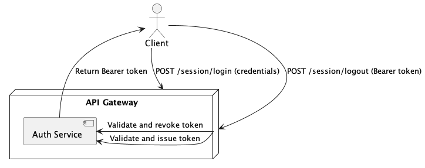
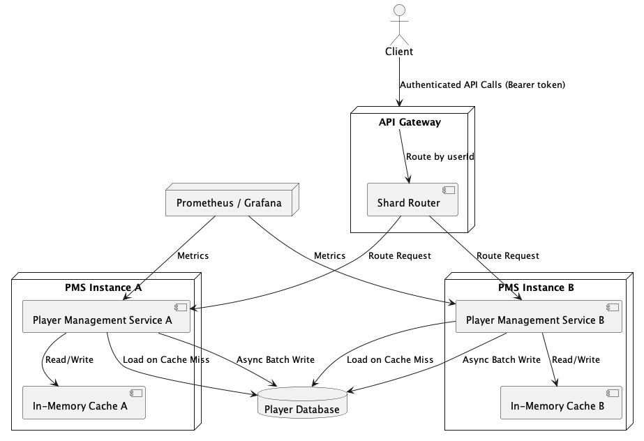
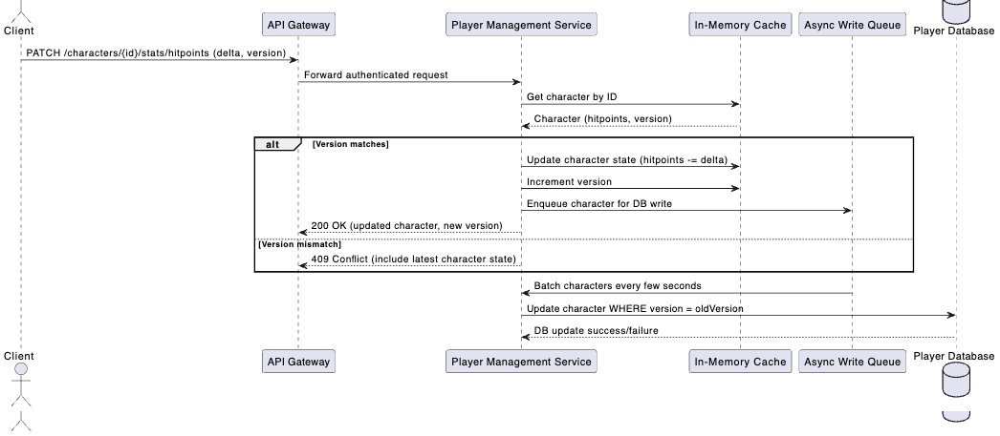

# RPG Character Manager Service Extension - Technical Design Document

## 1. Goals

- **Extend the Player Management Service (PMS)** to support **server-authoritative real-time multiplayer** gameplay for a small to moderate concurrency RPG (inspired by Baldur’s Gate).
- **Tighten security and data integrity**:
  - Authentication and session validation on every request.
  - Enforce character ownership.
  - Clients send **intents**, not final data.
- **Achieve low latency at moderate concurrency**:
  - Handle thousands of concurrent users efficiently.
  - Fast access to player data through in-memory caching.
  - Avoid costly synchronous database access per request.
- **Design for Simplicity and Evolvability**:
  - Favor a simple, robust architecture first.
  - Plan clear exit paths for scaling and resilience improvements later.

## 2. Non-Goals

- **Not targeting millions of concurrent players**: Support small to mid-size multiplayer sessions (hundreds to low-thousands of CCU).
- **Not implementing Game Simulation services**: Only **Player and Character Management** is covered.
- **Not covering live session management or matchmaking**: No real-time combat simulation or session orchestration.

## 3. Proposed Architectural Changes

| Area                   | Current                          | Proposed Extension                                    |
|------------------------|----------------------------------|------------------------------------------------------|
| Deployment             | Single server                    | Horizontally scalable, stateful service              |
| Data Access            | Direct DB writes                 | In-memory cache per instance + async DB writes       |
| Authentication         | Basic API key                    | Token-based session authentication (JWT/Bearer)      |
| Ownership Enforcement  | None                             | Every request validated against session ownership    |
| Concurrency Handling   | None                             | Optimistic concurrency (versioning)                  |
| Consistency Guarantees | Best-effort                      | Server authoritative (client sends intent, not result) |
| API Gateway            | None                             | Centralized routing, authentication, sharding       |

### New Components
- **API Gateway + Shard Router**: Route requests based on userId.
- **Auth Service**: Issue and validate session tokens.
- **Player Management Service**:
  - **Local in-memory cache** for active character data.
  - **Lazy loading** from DB on cache miss.
  - **Optimistic concurrency control** (to achieve performance under concurrency).
- **Monitoring Stack**: Prometheus + Grafana + OpenTelemetry.

### Deployment Diagrams

#### Login and Logout Flow



#### Authenticated Calls



## 4. Simplicity and Exit Plan

| Challenge                        | Initial Simple Solution                           | Migration / Exit Path        |
|----------------------------------|---------------------------------------------------|-------------------------------|
| Low-latency player data access   | Local **in-memory cache** per server              | Add Redis/Distributed Cache later if needed |
| Resilience to node failure       | **Lazy reload** character state from DB on cache miss | Optional cache replication in Redis |
| Load distribution                | **Shard routing** at API Gateway based on `userId` | Move to Consistent Hashing |
| Scaling players across servers   | **Horizontal scaling** (stateless per group of players) | Introduce service discovery |

**Key principle**:
- **No external cache** dependency at MVP.
- **Accept brief reloading cost** if a server goes down.
- **Smooth migration** to more complex caching or clustering only if needed.


> **Tradeoff**: We favor a simple in-memory design initially to optimize for developer velocity and operational simplicity. If player CCU increases or failover speed becomes critical, we can incrementally add Redis or distributed caching without redesigning core service behavior.

## 5. Shard Routing Strategy

* Requests are routed to Player Management Service instances based on userId extracted from the session token.

* `characterId` is always passed along with the request and validated inside the PMS to ensure ownership.

* This allows grouping all of a user's characters on the same shard, simplifying cache locality and minimizing cross-shard communication.

## 5. Proposed API Changes and Functionality

All API endpoints except for session login (`POST /session/login`) require a valid Bearer token for authentication.

- **`POST /session/login`**: **(New)** Authenticate a player and return a session token (Bearer token).
- **`POST /session/logout`**: **(New)** Revoke the session token and clear session-related cache.
- **`POST /characters`**: Create a new character. Requires Bearer token; links character to session user ID.
- **`GET /characters`**: **(New)** Fetch all characters associated with the current session user ID.
- **`GET /characters/{id}`**: Fetch the latest authoritative character state, including derived stats, from cache (fallback to database).
- **Other Character Modifications (e.g., PATCH /characters/{id}/stats/hitpoints, POST /characters/{id}/equipment/*, PATCH /currency/modify)**:
  - Clients send intents (e.g., "equip armor", "apply hitpoint delta", "modify currency"), not final state.
  - Server validates ownership and action legality.
  - Server checks version for optimistic concurrency control.
  - On success, server returns the updated character with all derived stats.
  - On version conflict, server returns 409 Conflict with the latest character state and derived stats.

After any successful character modification, the server will return the full updated character state, including base fields and any derived side effects (e.g., Armor Class, movement speed, saving throw bonuses). This ensures the client remains fully synchronized with the server’s authoritative view.

## 6. Concurrency / Race Condition Handling

### Versioning Strategy

Each character entity maintains a `version` field that is incremented on every successful update. This ensures optimistic concurrency control.

### Example Flows

**Taking Damage:**
1. Client fetches character (HP: 30, Version: 5).
2. Client sends PATCH request to reduce HP by 10, providing version 5.
3. Server checks version:
   - If matches (5), applies change (HP 20), increments version to 6.
   - If mismatch, responds with HTTP 409 Conflict **and returns the latest character state**.



### On Version Mismatch

If the client's version does not match the server's, the server responds with a Conflict status code
and the latest correct version of the character data.
```json
HTTP 409 Conflict
{
  "error": "Version mismatch. Please refresh.",
  "character": {
    "id": "f81d4fae-7dec-11d0-a765-00a0c91e6bf6",
    "hitpoints": 20,
    "equipment": ...
    ...
    "version": 6,
  }
}
```
This allows the client to update its local copy. It is up to the application
to decide what to do when a conflict occurs. Attempting to reduce the hitpoints
on top of this new state, may or may not make sense.

### Cache to Database Persistence

**Async Batch Writing:**
- After every successful update, character state is updated in cache and enqueued into an async write queue.
- A background worker periodically (every 1-5 seconds) pulls characters from the queue and writes them in batch to the database.
- Batching reduces database load and improves throughput.

**Deduplication:**
- If multiple updates occur to the same character within a batch window, only the latest version is written to the database.

**Failure Handling:**
- If database writes fail after retries, the character ID can be moved to a dead letter queue for manual intervention.

## 7. Security Measures

- **Bearer token authentication** on all APIs.
- **Ownership checks** between session and requested character.
- **No trust in client-provided data**: Only send actions/commands, never final state.

## 8. System Health Monitoring

### 8.1 Observability Library

* Integrate OpenTelemetry for distributed tracing and structured logging.
* Metrics exported in Prometheus format and visualized via Grafana.
* Standardized health probes (/health/live, /health/ready, /metrics).
* Add tracing to all critical application points
* Add latency metrics and tracing as a filter to all requests

### 8.2 KPIs

We can use `CloudWatch` to create Targets that trigger alerts based on the following KPIs:

| Service Area             | Metric                        | Threshold & Target                                      | Description / Alert Condition                                     |
|---------------------------|-------------------------------|---------------------------------------------------------|--------------------------------------------------------------------|
| **API Gateway**           | 5xx Error Rate                | Alert if >1% over 5 min                                 | Monitors backend or routing failures; high error rates suggest critical routing, auth, or backend health issues. |
| **Auth Service**          | Login Success Rate            | Alert if <95% over 10 min                               | Tracks authentication health; low success may indicate DB/cache failures or token service issues. |
| **Player Management APIs**| Average Request Latency (p95) | Alert if >300ms sustained over 5 min                    | Ensures API calls stay responsive under load. |
| **Player Management APIs**| Request Error Rate (4xx/5xx)  | Alert if >2% sustained over 5 min                       | High client/server error rate indicates systemic issues. |
| **Database**              | Write Latency (p95)           | Alert if >100ms for 5 min                               | Measures database write responsiveness (especially important for batched writes). |
| **Database**              | Write Failure Rate            | Alert if >0.1% over 10 min                              | Ensures data durability and triggers early intervention if persistence degrades. |
| **In-Memory Cache**       | Cache Hit Rate                | Alert if <95% sustained over 10 min                     | Low hit rates signal potential cache invalidation issues, bad shard routing, or service failures. |
| **In-Memory Cache**       | Cache Eviction Rate           | Monitor trend; alert if unexpected spike                | Tracks memory pressure; spikes could mean tuning issues or CCU increases. |
| **Async Writer Queue**    | Queue Backlog Size            | Alert if backlog > threshold (e.g., 5,000 items)        | Ensures async DB persistence keeps up with in-memory operations. |
| **Async Writer Queue**    | Persistence Latency (p95)     | Alert if >500ms over 5 min                              | Tracks end-to-end DB write performance including queuing delays. |
| **Dead Letter Queue (DLQ)**| DLQ Size                     | Alert if non-zero for more than 5 min                   | Indicates failed persistence attempts needing manual investigation. |
| **System Infrastructure**| CPU Usage                     | Alert if >80% over 10 min                               | Monitors instance scaling needs. |
| **System Infrastructure**| Memory Usage                  | Alert if >80% over 10 min                               | Identifies memory pressure early, especially important for in-memory cache nodes. |
| **Availability**          | Service Uptime                | 99.9% monthly target                                    | Captures end-to-end service reliability. |