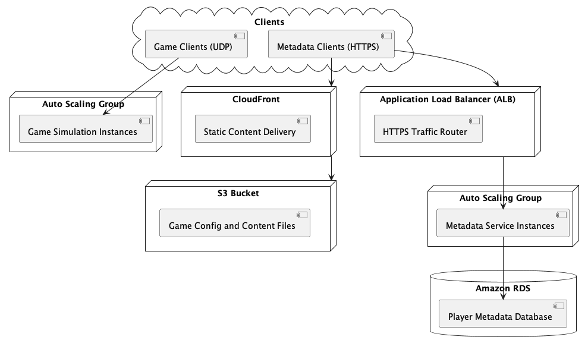

# Player Infrastructure Deployment - Terraform

This repository provisions a complete AWS environment for real-time multiplayer services.
The terraform modules can be found in `/infra`

## Services Deployed

| Service | Description |
|:---|:---|
| **Metadata Service** | Stateless HTTPS service behind an ALB (Application Load Balancer) |
| **Game Simulation Service** | Stateless UDP service scaling per game sessions |
| **RDS Database** | Amazon RDS (PostgreSQL) provisioned with schema and seed data |
| **Static Data Store** | S3 bucket + CloudFront to serve static game configuration/content |

---

## Architecture Overview



- **Clients** → **CloudFront** → **S3** (static assets)
- **Clients** → **ALB** → **Metadata Service**
- **Clients (UDP)** → **Game Simulation Service**
- **Metadata Service** → **RDS Database**

---

## Project Structure

```plaintext
/infra
  /modules
    /alb
    /metadata_service
    /game_sim_service
    /rds_database
    /static_store
  main.tf
  variables.tf
  outputs.tf
terraform.tfvars
```

---

## Assumptions

- 1 Metadata Service instance supports **100 CCU**.
- 1 Game Sim server can handle **10 game sessions** (4 players each).
- Services are stateless and horizontally scalable.
- Static data is served globally through **CloudFront**.
- Database is single-region for simplicity (expandable later).

---

## Game Sim Service Autoscaling

The Game Simulation Service **Auto Scaling Group** is configured with a **Target Tracking Scaling Policy** based on a **custom CloudWatch metric**:

| Item | Description |
|:---|:---|
| **Metric Name** | `ActiveGameSessions` |
| **Namespace** | `GameSimService` |
| **Target Value** | 10 active sessions per EC2 instance |

**Goal**: Automatically add or remove Game Simulation servers to maintain approximately 10 active game sessions per server.

### Important Note

The **Game Simulation service** must **publish the `ActiveGameSessions` metric** to CloudWatch at regular intervals.
Without this metric, autoscaling will not trigger correctly.

---

## Live Server Deployment Strategies (High CCU)

| Strategy | Pros | Cons |
|:---|:---|:---|
| **Canary Deployment** | Gradually shifts a small % of real players to the new version. Early detection of bugs in production. Very low risk to live sessions. | More complex setup (requires traffic shaping or service mesh). Slightly slower rollout. |
| **Blue/Green Deployment** | Zero downtime; easy rollback by switching DNS or ALB target group. Good for large, global player bases. | Higher cost because two full environments must run simultaneously. |

For a high-CCU environment with global users, **Canary Deployment** is recommended for safer, gradual rollouts. **Blue/Green Deployment** is ideal for major updates requiring fast rollback.

### Global Deployment Considerations

- **Cyclical Player Load**: Player session counts rise and fall daily. Deployments should occur during regional low-traffic periods to minimize disruption.
- **Regional Rollouts**: Canary deployments can be phased per region (e.g., start with APAC, then EU, then US) to limit risk exposure.
- **Staggered Update Strategy**: Combine canary percentages (e.g., 5%, 25%, 50%) with regional time windows for maximum safety.

---

### Client Regional Routing

Clients connect to the Metadata Service via a Route 53 DNS endpoint with geolocation routing. This automatically routes players to the nearest AWS region based on their IP address.

**Alternatives:**
- **Explicit Region Selection**: The client app allows players to select their preferred region manually (common in many multiplayer games).
- **Global Accelerator**: Use AWS Global Accelerator to route traffic to the closest healthy endpoint using Anycast IP.
