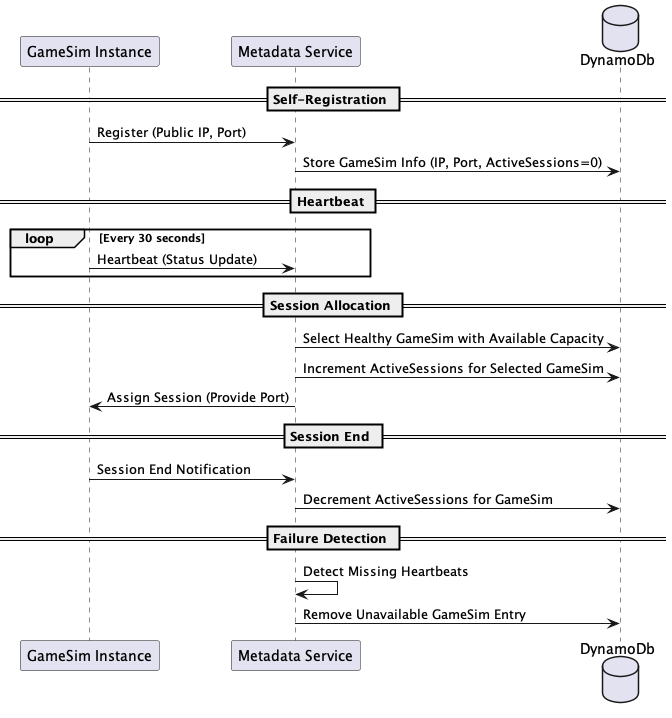

# RPG Character Manager - Fortis Prompt Part 2

This repository provisions a complete AWS environment for real-time multiplayer services.
The terraform modules can be found in `/infra`

## Services Deployed

| Service | Description |
|:---|:---|
| **Metadata Service** | Stateless HTTPS service behind an ALB (Application Load Balancer)  |
| **Game Simulation Service** | Stateless UDP service scaling per game sessions             |
| **DynamoDb Database** | Amazon DynamoDb provisioned with schema and seed data             |
| **Static Data Store** | S3 bucket + CloudFront to serve static game configuration/content |

> Note: In a production environment, we may want to separate the Metadata Service from the Matchmaking / Game Sim
> creation. For the scope of this project given the prompt, we will reuse the Metadata Service to
> manage GameSim session lifecycle.

---

## Architecture Overview

- **Clients** → **CloudFront** → **S3** (static assets)
- **Clients** → **ALB** → **Metadata Service**
- **Clients (UDP)** → **Game Simulation Service**
- **Game Simulation Service** -> **Metadata Service**
- **Metadata Service** → **Dynamo Database**

---

## Assumptions

- 1 Metadata Service instance supports **100 CCU**.
- 1 Game Sim server can handle **10 game sessions** (4 players each).
- Services are stateless and horizontally scalable.
- Static data is served globally through **CloudFront**.
- No Load Balancer on top of GameSim (prompt specifies ELB for Metadata Service but not GameSim)
- Single region deployment with future multi-region adoption. (See [Multi-regional deployment](#multi-regional-deployment-future-improvement))

---

## Game Session Creation and Join Flow

- **Session Creation**:
  A player client sends a `Create New GameSim Request` to the Metadata Service via the Application Load Balancer (`HTTPS`).
  The Metadata Service allocates a new `GameSimId`, selects a GameSim instance with available capacity, records the mapping in DynamoDb, and returns the connection details to the client.

- **Session Joining**:
  A player client sends a `Join Existing GameSim Request` with an existing `GameSimId`.
  The Metadata Service validates the ID and fetches the mapping from DynamoDb, returning the corresponding GameSim instance connection details.

- **Gameplay Phase**:
  The client connects directly via `UDP` to the assigned GameSim instance and participates in the game session.
  During gameplay, the GameSim service periodically sends asynchronous updates (e.g., player state, loot, match events) to the Metadata Service.

- **Session Finalization**:
  Upon match completion, the GameSim instance sends a final closing update to the Metadata Service, which updates the final state in DynamoDb.

---

### GameSim Registration and Heartbeat Mechanism

Because we do not have a load balancer on top of GameSim instances, the clients cannot be routed to the right instance
via the gameSimId. Because of that, game clients will need the IP:Port given to them after a new simulation session is joined
or created. This means that our Metadata Service needs to act as a load balancer at an application level, and store / fetch
the GameSim routing information in DynamoDb.
In a production environment, we would favor using an NLB and use the GameSimId as a seed for the routing / instance selection,
which would all be handled by the load balancer.

- **Self-Registration**:
  Upon startup, each GameSim instance will register itself with the Metadata Service, providing its public IP / port.
  The Metadata Service stores this info in DynamoDb, as well as initializing the number of active sessions to 0.

- **Heartbeat / Health Checks**:
  GameSim instances periodically (e.g., every 30 seconds) send heartbeat messages to the Metadata Service to signal they are healthy and available.

- **Session Allocation**:
  When a new session is created, the Metadata Service selects a healthy GameSim instance with available capacity and
  updates the amount of active sessions for that instance in DynamoDb.

- **Session End**:
  When a session ends, the GameSim service notifies the Metadata Service which in turn reduces the amount of active sessions in
  DynamoDb.

- **Failure Detection**:
  If a GameSim instance misses heartbeat intervals, the Metadata Service marks it as unavailable, removes it from the pool, and
  reduces the amount of active sessions in DynamoDb.

## GameSim Service Autoscaling

To achieve autoscaling for the GameSim Service Auto Scaling Groups in each region, we can create a `Target Tracking Scaling Policy` based on a custom `CloudWatch` metric.

A GameSim service will publish `ActiveGameSessions` each time the number of active sessions changes for that instance, and
at an interval chosen (can start every 60 seconds).

A target tracking scaling policy will track the number of active sessions over the total number of game sim instances, and
trigger scale in or out based on our defined threshold.

### Important Note

The Game Simulation service must publish the `ActiveGameSessions` metric to `CloudWatch` at regular intervals.
Without this metric, autoscaling will not trigger correctly.

---

## Live Server Deployment Strategies

### 1. Blue-Green Deployment

In a blue-green deployment, we run two identical production environments, "Blue" and "Green".

* Blue is the live version.
* Green is the version we are rolling out.
* Once Green is fully deployed and validated, traffic is switched over from Blue to Green.

Pros:

* Near zero downtime: Traffic is not switched over until sessions are drained
* Easy rollback: If issues appear, we can revert to the previous (Blue) environment
* Testability: We can test the new version fully before routing traffic to it

Cons:

* Double infrastructure cost: We need to run two full production environments in parallel.
* Session stickiness issues: Active sessions may be dropped. For our use case, not migrating sessions is fine, so this is not a big concern.

Used when: We want a quick switchover with instant ability to recover from critical issues.

### 2. Canary Deployment

A canary deployment consists in rolling out a new version to a small percentage of users first, while the rest stay on the old version. We gradually ramp up the percentage
of rolled out instances if no issues are detected.

Pros:

* Minimum risk: Issues are surfaced earlier, with only a small fraction of users experiencing them as we rollout.
* Flexible scaling: Can increase the rollout % slowly or fast depending on stability.

Cons:

* Versioning: Clients may need to be compatible with multiple server versions.
* Slow Rollback: If issues appear, rollback across multiple partially upgraded servers can get messy.
* Player fairness: Some players may get a different experience during rollout window.

Used when: We expect medium to high risk changes being deployed

### Recommended strategy

Given that our game will present standard cyclical game session counts across all regions, I recommend using a canary deployment outside of peak hours on each region.
We can additionally combine this with a blue-green deployment in other regions after the new version has been validated.

---

## Future Improvements

### Multi Regional Deployment

With the current architecture, it would be rather easy to support regional servers.

We could use Route 53 DNS to automatically select the closest Application Load Balancer for the region,
which would then route clients to the right AWS VPC.
Note that routing Cloudfront requests for static content would not change in this implementation.

Alternatively, we could let players select their desired region in game, which is very common and sometimes
more desirable (players wanting to play with their friends despite latency increase).

---

### Load Balancing GameSim

- **Current Behavior**:
  In the MVP architecture, the Metadata Service returns the GameSim `IP address` and `port` directly to the client.
  This allows clients to connect via `UDP` without needing a load balancer. However, it does introduce application
  complexity as we need game sims to register themselves on load, as well as keep track of them. (see [GameSim Registration and Heartbeat Mechanism](#gamesim-registration-and-heartbeat-mechanism))

- **Future Improvement**:
  Instead of directly returning infrastructure details (`IP/Port`) to the client, the Metadata Service could simply return a `GameSimId`.
  This `GameSimId` would map to a Network Load Balancer (`NLB`) target group in AWS, which would route `UDP` traffic dynamically to the correct GameSim instance.

**Advantages of returning only a GameSimId**:
  - **Infrastructure Decoupling**: Clients do not need to know or care about specific IPs or ports.
  - **Elasticity**: GameSim instances can be replaced or rescheduled without breaking active sessions.
  - **Security**: Hides internal IP addresses from players.
  - **Consistency**: Simplifies handling scaling events (e.g., GameSim server replacement or auto-healing).
