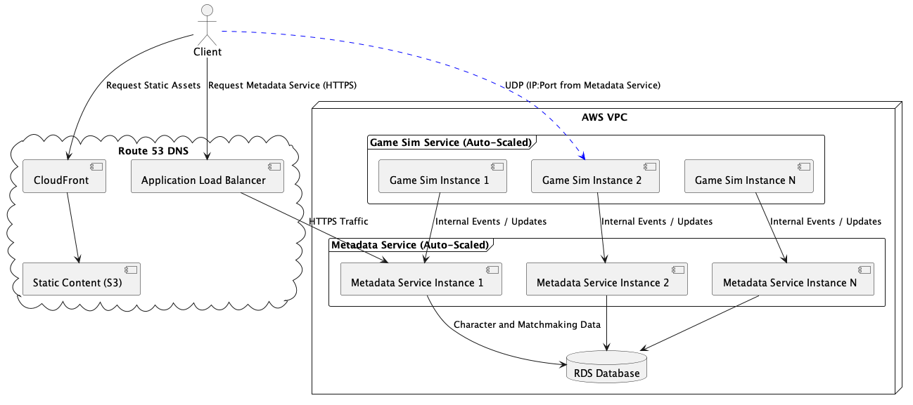
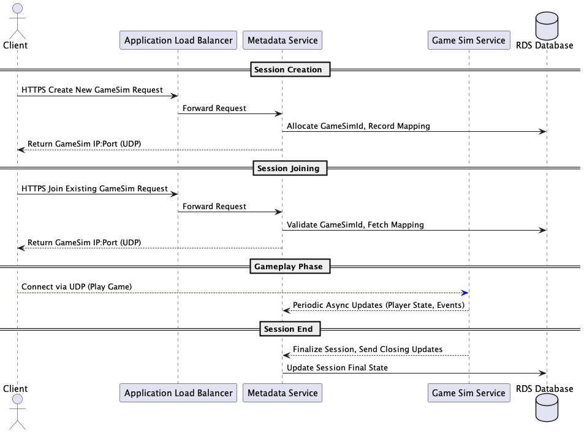

# Player Infrastructure Deployment - Terraform

This repository provisions a complete AWS environment for real-time multiplayer services.
The terraform modules can be found in `/infra`

## Services Deployed

| Service | Description |
|:---|:---|
| **Metadata Service** | Stateless HTTPS service behind an ALB (Application Load Balancer)  |
| **Game Simulation Service** | Stateless UDP service scaling per game sessions             |
| **RDS Database** | Amazon RDS (PostgreSQL) provisioned with schema and seed data          |
| **Static Data Store** | S3 bucket + CloudFront to serve static game configuration/content |

> Note: In a production environment, we may want to separate the Metadata Service from the Matchmaking / Game Sim
> creation. For the scope of this project given the prompt, we will reuse the Metadata Service to
> manage GameSim session lifecycle.

---

## Architecture Overview

- **Clients** → **CloudFront** → **S3** (static assets)
- **Clients** → **ALB** → **Metadata Service**
- **Clients (UDP)** → **Game Simulation Service**
- **Game Simulation Service** -> **Metadata Service**
- **Metadata Service** → **RDS Database**

---

## Assumptions

- 1 Metadata Service instance supports **100 CCU**.
- 1 Game Sim server can handle **10 game sessions** (4 players each).
- Services are stateless and horizontally scalable.
- Static data is served globally through **CloudFront**.
- Multi-regional GameSim  

---

## Game Session Creation and Join Flow

The following diagram describes the game session connection lifecycle:

- **Session Creation**:  
  A player client sends a **Create New GameSim Request** to the Metadata Service via the Application Load Balancer (HTTPS).  
  The Metadata Service allocates a new `GameSimId`, selects a GameSim instance with available capacity, records the mapping in the RDS database, and returns the connection details to the client.

- **Session Joining**:  
  A player client sends a **Join Existing GameSim Request** with an existing `GameSimId`.  
  The Metadata Service validates the ID and fetches the mapping from the RDS database, returning the corresponding GameSim instance connection details.

- **Gameplay Phase**:  
  The client connects **directly via UDP** to the assigned GameSim instance and participates in the game session.  
  During gameplay, the GameSim service periodically sends **asynchronous updates** (e.g., player state, loot, match events) to the Metadata Service.

- **Session Finalization**:  
  Upon match completion, the GameSim instance sends a **final closing update** to the Metadata Service, which updates the final state in the RDS database.

---

### GameSim Registration and Heartbeat Mechanism

In order for the Metadata Service to assign players to active GameSim instances, it must have a real-time view of available capacity.

- **Self-Registration**:  
  Upon startup, each GameSim instance registers itself with the Metadata Service, providing:
  - Private IP address
  - List of UDP ports
  - Maximum session capacity
  - Current active sessions count

- **Heartbeat / Health Checks**:  
  GameSim instances periodically (e.g., every 30 seconds) send heartbeat messages to the Metadata Service to signal they are healthy and available.

- **Session Allocation**:  
  When a new session is created, the Metadata Service selects a healthy GameSim instance with available capacity and allocates a port.

- **Failure Detection**:  
  If a GameSim instance misses heartbeat intervals, the Metadata Service marks it as unavailable and removes it from the pool.

This dynamic registry allows the Metadata Service to route players reliably without hard-coding IPs or ports.

## Game Sim Service Autoscaling

The Game Simulation Service **Auto Scaling Group** is configured with a **Target Tracking Scaling Policy** based on a **custom CloudWatch metric**:

| Item | Description |
|:---|:---|
| **Metric Name** | `ActiveGameSessions` |
| **Namespace** | `GameSimService` |
| **Target Value** | 10 active sessions per EC2 instance |

**Goal**: Automatically add or remove Game Simulation servers to maintain approximately 10 active game sessions per server.

### Important Note

The **Game Simulation service** must **publish the `ActiveGameSessions` metric** to CloudWatch at regular intervals.
Without this metric, autoscaling will not trigger correctly.

---

## Live Server Deployment Strategies (High CCU)

| Strategy | Pros | Cons |
|:---|:---|:---|
| **Canary Deployment** | Gradually shifts a small % of real players to the new version. Early detection of bugs in production. Very low risk to live sessions. | More complex setup (requires traffic shaping or service mesh). Slightly slower rollout. |
| **Blue/Green Deployment** | Zero downtime; easy rollback by switching DNS or ALB target group. Good for large, global player bases. | Higher cost because two full environments must run simultaneously. |

For a high-CCU environment with global users, **Canary Deployment** is recommended for safer, gradual rollouts. **Blue/Green Deployment** is ideal for major updates requiring fast rollback.

### Global Deployment Considerations

- **Cyclical Player Load**: Player session counts rise and fall daily. Deployments should occur during regional low-traffic periods to minimize disruption.
- **Regional Rollouts**: Canary deployments can be phased per region (e.g., start with APAC, then EU, then US) to limit risk exposure.
- **Staggered Update Strategy**: Combine canary percentages (e.g., 5%, 25%, 50%) with regional time windows for maximum safety.

---

### Client Regional Routing

Clients connect to the Metadata Service via a Route 53 DNS endpoint with geolocation routing. This automatically routes players to the nearest AWS region based on their IP address.

**Alternatives:**
- **Explicit Region Selection**: The client app allows players to select their preferred region manually (common in many multiplayer games).
- **Global Accelerator**: Use AWS Global Accelerator to route traffic to the closest healthy endpoint using Anycast IP.

---

### Infrastructure Nuances and Improvements

- **Current Behavior**:  
  In the MVP architecture, the Metadata Service returns the **GameSim IP address and port** directly to the client.  
  This allows clients to connect via UDP without needing a load balancer. However, it does introduce application
  complexity as we need game sims to register themselves on load, as well as keep track of them. (see [GameSim Registration and Heartbeat Mechanism](#gamesim-registration-and-heartbeat-mechanism)) 

- **Future Improvement**:  
  Instead of directly returning infrastructure details (IP/Port) to the client, the Metadata Service could simply return a **GameSimId**.  
  This `GameSimId` would map to a **Network Load Balancer (NLB)** target group in AWS, which would route UDP traffic dynamically to the correct GameSim instance.

**Advantages of returning only a GameSimId**:
  - **Infrastructure Decoupling**: Clients do not need to know or care about specific IPs or ports.
  - **Elasticity**: GameSim instances can be replaced or rescheduled without breaking active sessions.
  - **Security**: Hides internal IP addresses from players.
  - **Consistency**: Simplifies handling scaling events (e.g., GameSim server replacement or auto-healing).
